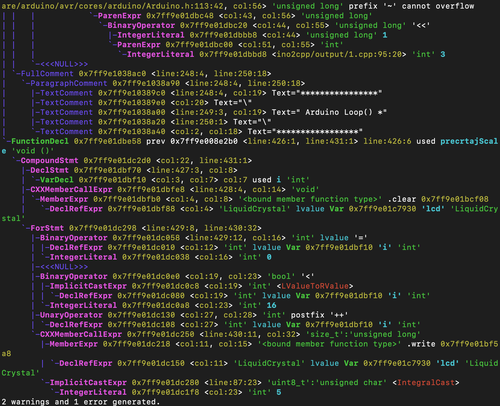

# ino2cpp
Convert Arduino INO sketches to C++

# Abstract
Arduino sketches and C++ are very similar. However, an INO file cannot be compiled as-is by C/C++ compilers (e.g., GCC). This tool converts INO sketches to C++ code such that off-the-shelf compilers and static analysis tools can be executed on the code.

# Converter
There are three steps in this conversion [1][2]:
1. **Generate forward declarations**. Arduino INO sketches allow the use of a function before its definition. The first step is to parse the INO sketch to obtain function signatures, and generate a header file with these signatures ("sketch_name.h").
2. **Includes**. Two includes are inserted before the content of the INO sketch: #include <Arduino.h>, and #include "sketch_name.h". Future work includes the parsing of header files from Arduino's standard library, search the Arduino app install path for the library, and include these dependencies in a Makefile.
3. **Write C++ to disk**. Write the resulting C++ file to disk.

# Usage Example
```
$ python ino2cpp.py examples/*.ino -o output
writing to output/1.cpp
writing to output/2.cpp
$ ls output/
1.cpp 1.h   2.cpp 2.h
$ cat output/1.h
void updateScale();
void isrEncoder();
void isrSwitch();
void setup();
void loop();
void precrtajScale();
$ head -2 output/1.cpp 
#include <Arduino.h>
#include "1.h"
```

The generated C++ files can now be statically analyzed. For example, using clang to dump the AST as follows:

```
clang -Xclang -ast-dump -x c++ -fsyntax-only -D__AVR_ATmega328P__ -DARDUINO=100 -DF_CPU=16000000L -Wno-unknown-attributes -Wno-attributes -I/path/to/local/Arduino/JavaAppAndIncludedLibraries output/1.cpp
```



# References
[1] https://arduino.stackexchange.com/questions/32998/how-to-convert-arduino-example-sketch-to-a-complete-c-project<br>
[2] https://forum.arduino.cc/index.php?topic=232632.0
